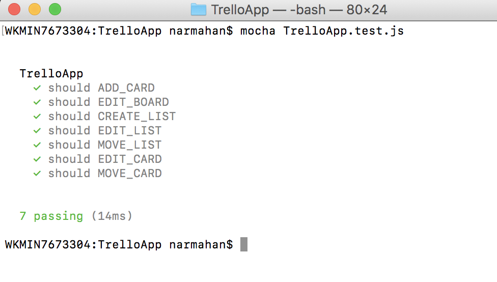

## Reducer-Unit-Test
Unit testing for the reducer files.

### Dependencies -
```
Redux, Mocha and Chai
```

### Report -
```
To generate the report -
  - mocha test-case fileName ( make sure mocha is install in globally )
```

### Screen-short Image -


### Changelog -
> 0.0.1: version

### Licence []()
> The MIT License (MIT)

